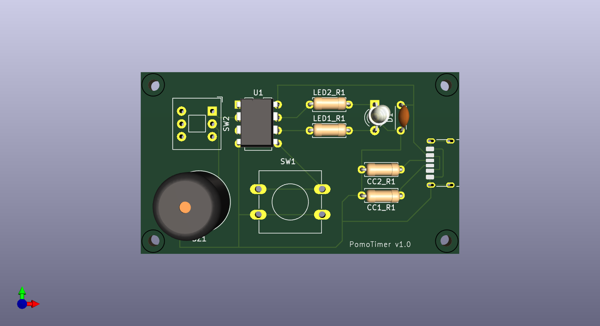

# Pomodoro Timer

## Description
The **Pomodoro Timer** is a timer designed to manage productivity using the Pomodoro Technique.

The work intervals are as follows:

There are three 25-minute work intervals, each separated by a break of 5 mins. After the fourth work session (or **Pomodoro** as I just call it), there is a longer 15 minute break. This cycle continues until the Pomodoro Timer is reset or powered off. 

The code is for an ATTiny85 microcontroller. The hardware and PCB design are shown below.

  

## Contributing
Contributions are welcome! Please follow these steps to contribute:
1. Fork the repository.
2. Create a new branch for your feature or bug fix.
3. Submit a pull request with a clear description of your changes.

## License
This project is licensed under the MIT License. See the [LICENSE](LICENSE) file for details.
